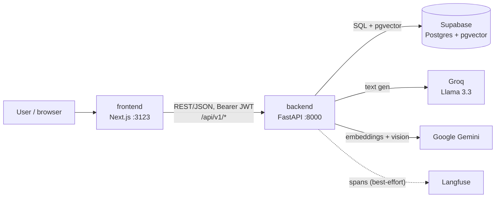
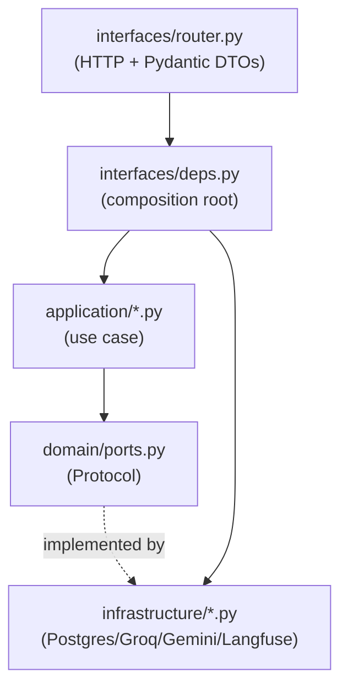

# Architecture

Solution Design Docs (SDDs) for Content Suite, following arc42. The backend is
**DDD / hexagonal**, one bounded context per folder under
[`backend/app/contexts/`](../../backend/app/contexts/); the SDDs below cut
*across* those contexts by concern.

## Bounded contexts

| Context | Owns | Key aggregate |
|---|---|---|
| `identity_access` | login, JWT, RBAC, users, audit log, seed | `User`, `PermissionPolicy` |
| `brand_identity` | brand manual, rules, RAG index | `BrandManual` |
| `content_creation` | on-brand generation via RAG | `Content` |
| `governance` | approval flow + multimodal audit | `AuditReport` (+ drives `Content`) |

Each context has four layers (dependencies point inward):

```
interfaces/  ──▶  application/  ──▶  domain/
    │                  │              (models, invariants, ports/Protocols — no I/O)
    └──────────────────┴──▶  infrastructure/  (adapters implementing ports)
```

- `domain/` — pure: dataclasses, invariants, `Protocol` ports.
- `application/` — use cases orchestrating domain + ports.
- `infrastructure/` — adapters (Postgres, Groq, Gemini, Langfuse).
- `interfaces/` — FastAPI router + `deps.py` (composition root that wires adapters).

## C4 — container view



## Component wiring (composition root)

Routers are mounted under `/api/v1` in
[`main.py:44`](../../backend/app/main.py). Each context's `interfaces/deps.py`
is the composition root: it constructs use cases with concrete adapters and is
overridden in tests via `app.dependency_overrides`.



## SDDs by concern

| SDD | Reads |
|---|---|
| [authentication-authorization](authentication-authorization.md) | how login, tokens, and the RBAC matrix work |
| [persistence](persistence.md) | schema, pooler, connection pool, migrations |
| [rag-retrieval](rag-retrieval.md) | embedding + vector search + retrieve-before-generate |
| [external-integrations](external-integrations.md) | Groq / Gemini adapters and their ports |
| [observability](observability.md) | Langfuse spans and the best-effort tracing wrapper |
| [security-and-pii](security-and-pii.md) | password hashing, secrets, CORS, prod hardening |
| [content-lifecycle](content-lifecycle.md) | the content state machine end to end |

## Why there is no jobs/queues SDD

The arc42 checklist expects a "background jobs / async workers" concern. This
system deliberately has **none**: every use case runs inside the request that
triggered it — LLM calls, embedding, vector search, and vision are all
synchronous HTTP-in / HTTP-out. Even Langfuse spans are flushed inline
([`langfuse_tracer.py:37`](../../backend/app/shared/langfuse_tracer.py)). There
is no message broker, cron, or worker process. If async work is ever added
(e.g. batch re-embedding), create `architecture/jobs.md` and link it here.
