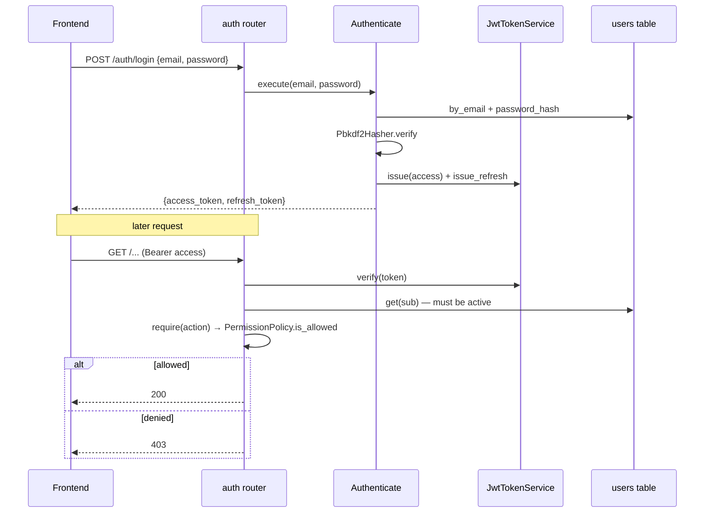

# SDD — Authentication & Authorization

| | |
|---|---|
| **Status** | Stable |
| **Context** | `identity_access` |
| **Concern** | Who you are (JWT) and what you may do (RBAC) |
| **Source of truth** | [`domain/models.py`](../../backend/app/contexts/identity_access/domain/models.py) (matrix), [`interfaces/deps.py`](../../backend/app/contexts/identity_access/interfaces/deps.py) (guards) |
| **Related** | [security-and-pii](security-and-pii.md), [content-lifecycle](content-lifecycle.md) |

## TL;DR

Login exchanges email + password for a short-lived **access** JWT and a
long-lived **refresh** JWT (HS256). Every protected request carries
`Authorization: Bearer <access>`; a FastAPI dependency verifies it, loads the
active user, and — for write actions — checks a static **RBAC matrix** that
gives each role exactly one stage of the workflow (strict separation of duties).

## Flow

## Token model

- **Access** token: claims `sub`, `rol`, `type="access"`, default TTL 120 min
  (`JWT_TTL_MIN`).
- **Refresh** token: claims `sub`, `type="refresh"`, TTL 7 days.
- The `type` claim keeps a refresh from being accepted as an access token
  (`get_current_user` rejects `type=="refresh"`).
- Frontend stores both in `localStorage` and transparently retries once via
  `/auth/refresh` on a 401 ([`frontend/lib/api.ts:49`](../../frontend/lib/api.ts)).

## RBAC matrix

| Role | Allowed action | Stage |
|---|---|---|
| `SUPERADMIN` | `MANAGE_USERS` | user administration |
| `CREADOR` | `CREATE_BRAND`, `GENERATE_CONTENT` | authoring |
| `APROBADOR_A` | `APPROVE_CONTENT` | approve / reject |
| `APROBADOR_B` | `AUDIT_IMAGE` | multimodal audit |

Enforcement is layered: the router `require(action)` guard is the HTTP boundary,
and `ManageUsers` re-checks `is_allowed` in the use case as defense in depth
([`manage_users.py:34`](../../backend/app/contexts/identity_access/application/manage_users.py)).

## Reference index

| What | Where |
|---|---|
| `Role` enum | [`domain/models.py:7`](../../backend/app/contexts/identity_access/domain/models.py) |
| `Action` enum | [`domain/models.py:14`](../../backend/app/contexts/identity_access/domain/models.py) |
| `PermissionPolicy` matrix + `is_allowed` | [`domain/models.py:22`](../../backend/app/contexts/identity_access/domain/models.py) |
| `Authenticate` / `RefreshAccess` use cases | [`application/authenticate.py`](../../backend/app/contexts/identity_access/application/authenticate.py) |
| JWT issue/verify (HS256, PyJWT) | [`infrastructure/jwt_token_service.py:16`](../../backend/app/contexts/identity_access/infrastructure/jwt_token_service.py) |
| `get_current_user` (verify + load active user) | [`interfaces/deps.py:41`](../../backend/app/contexts/identity_access/interfaces/deps.py) |
| `require(action)` guard factory | [`interfaces/deps.py:60`](../../backend/app/contexts/identity_access/interfaces/deps.py) |
| Login / refresh / me routes | [`interfaces/router.py:57`](../../backend/app/contexts/identity_access/interfaces/router.py) |
| User admin routes (Superadmin) | [`interfaces/router.py:80`](../../backend/app/contexts/identity_access/interfaces/router.py) |
| Frontend refresh-on-401 | [`frontend/lib/api.ts:83`](../../frontend/lib/api.ts) |
| Frontend session rehydration | [`frontend/contexts/auth-context.tsx:24`](../../frontend/contexts/auth-context.tsx) |

## Maintenance checklist

- [ ] Added a new protected action? Add it to `Action`, wire it into
      `PermissionPolicy._MATRIX`, and guard the route with `require(...)`.
- [ ] Added a role? Update the matrix, the frontend `Role` enum, `ROUTE_ROLES`,
      and `ROLE_LABELS`.
- [ ] Changed token claims/TTL? Re-check `get_current_user` and the frontend
      refresh flow.
- [ ] `JWT_SECRET` is set to a real value in every non-local environment
      (see [security-and-pii](security-and-pii.md)).
