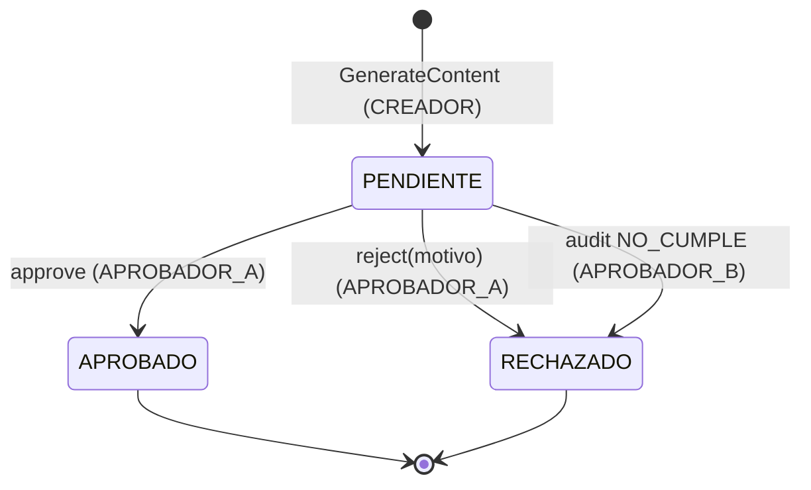
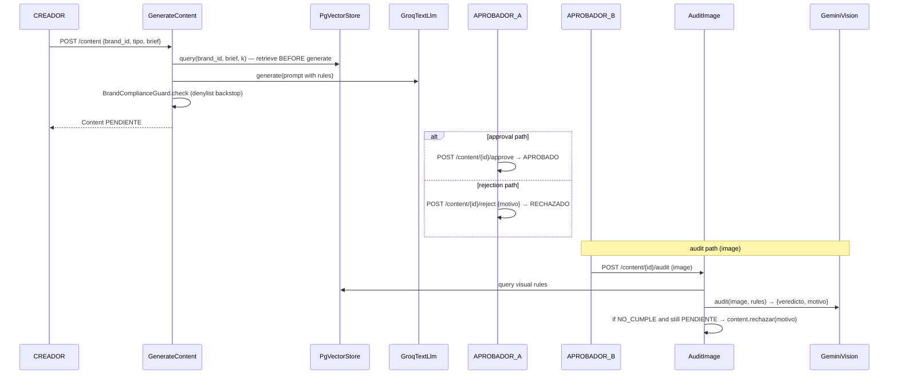

# SDD — Content Lifecycle

| | |
|---|---|
| **Status** | Stable |
| **Contexts** | `content_creation` (owns aggregate) + `governance` (drives transitions) |
| **Concern** | The state machine a content piece moves through, across contexts |
| **Source of truth** | [`content_creation/domain/models.py`](../../backend/app/contexts/content_creation/domain/models.py) |
| **Related** | [rag-retrieval](rag-retrieval.md), [authentication-authorization](authentication-authorization.md), [external-integrations](external-integrations.md) |

## TL;DR

A content piece is born `PENDIENTE`, then moves to `APROBADO` or `RECHAZADO`.
The transition **invariants live in the `Content` aggregate** — only `PENDIENTE`
can transition, and a rejection needs a reason. Three roles touch three
different stages: the Creator generates (grounded by RAG + a deterministic
compliance backstop), Approver A approves/rejects, and Approver B's image audit
can auto-reject a still-pending piece. This spans two contexts, which is why it
gets its own SDD.

## State machine

Any transition attempted from a non-`PENDIENTE` state raises `DomainError`
([`domain/models.py:34`](../../backend/app/contexts/content_creation/domain/models.py)).

## End-to-end flow

## Design notes

- **Invariants in the aggregate.** `aprobar()` / `rechazar()` enforce
  status + reason rules; use cases only load → transition → save
  ([`approve_content.py:18`](../../backend/app/contexts/governance/application/approve_content.py)).
- **Retrieve before generate.** RAG rules are pulled before the LLM call and
  injected into the prompt ([`generate_content.py:70`](../../backend/app/contexts/content_creation/application/generate_content.py)).
- **Deterministic compliance backstop.** After generation, an explicit denylist
  check can reject content the LLM let through
  ([`domain/compliance.py:12`](../../backend/app/contexts/content_creation/domain/compliance.py)).
- **Audit closes the loop — but only if still pending.** A `NO_CUMPLE` verdict
  auto-rejects the content *only* when `estado == "PENDIENTE"`; if already
  decided, the audit just records a report
  ([`audit_image.py:67`](../../backend/app/contexts/governance/application/audit_image.py)).
- **`NO_CUMPLE` requires a reason.** Enforced in `AuditReport.__post_init__`
  ([`governance/domain/models.py:27`](../../backend/app/contexts/governance/domain/models.py)).

## Reference index

| What | Where |
|---|---|
| `Content` aggregate + transitions | [`content_creation/domain/models.py:14`](../../backend/app/contexts/content_creation/domain/models.py) |
| `GenerateContent` use case | [`generate_content.py:40`](../../backend/app/contexts/content_creation/application/generate_content.py) |
| Content prompt builder | [`generate_content.py:29`](../../backend/app/contexts/content_creation/application/generate_content.py) |
| Compliance guard | [`content_creation/domain/compliance.py:12`](../../backend/app/contexts/content_creation/domain/compliance.py) |
| Approve / Reject use cases | [`governance/application/approve_content.py:18`](../../backend/app/contexts/governance/application/approve_content.py) |
| Image audit use case | [`governance/application/audit_image.py:39`](../../backend/app/contexts/governance/application/audit_image.py) |
| `AuditReport` + `Verdict` | [`governance/domain/models.py:8`](../../backend/app/contexts/governance/domain/models.py) |
| Content routes | [`content_creation/interfaces/router.py:71`](../../backend/app/contexts/content_creation/interfaces/router.py) |
| Governance routes | [`governance/interfaces/router.py:66`](../../backend/app/contexts/governance/interfaces/router.py) |

## Maintenance checklist

- [ ] New state or transition? Add it to `Content` with its invariant — never
      mutate `estado` directly in a use case or repo.
- [ ] New transition trigger? Route it through the aggregate's methods.
- [ ] Changed the audit auto-reject rule? Keep the `estado == "PENDIENTE"` guard
      so a decided piece isn't silently overwritten.
- [ ] Extending compliance beyond a denylist? Add an LLM verifier as a second
      step; keep the deterministic backstop.
