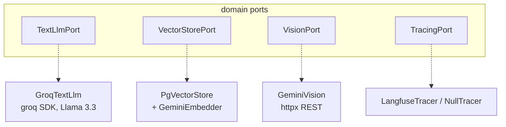

# SDD — External Integrations

| | |
|---|---|
| **Status** | Stable |
| **Concern** | Third-party AI providers behind domain ports |
| **Providers** | Groq (text), Google Gemini (embeddings + vision), Langfuse (traces) |
| **Source of truth** | each context's `infrastructure/` + [`config.py`](../../backend/app/config.py) |
| **Related** | [rag-retrieval](rag-retrieval.md), [observability](observability.md), [content-lifecycle](content-lifecycle.md) |

## TL;DR

Every external provider is an **adapter** behind a `Protocol` port. Domain and
use cases never import an SDK; they depend on `TextLlmPort`, `VectorStorePort`,
`VisionPort`, `TracingPort`. Swapping a provider means writing a new adapter and
rewiring `deps.py` — no domain change. Groq uses its Python SDK; Gemini is
called over raw REST with `httpx`.

## Provider map

| Port | Adapter | Provider | Transport | Config |
|---|---|---|---|---|
| `TextLlmPort` | `GroqTextLlm` | Groq (Llama 3.3) | `groq` SDK | `GROQ_API_KEY`, `GROQ_MODEL` |
| embedding (inside `VectorStorePort`) | `GeminiEmbedder` | Gemini | `httpx` REST | `GOOGLE_API_KEY`, `EMBEDDING_MODEL`, `EMBEDDING_DIM` |
| `VisionPort` | `GeminiVision` | Gemini | `httpx` REST | `GOOGLE_API_KEY`, `VISION_MODEL` |
| `TracingPort` | `LangfuseTracer` | Langfuse | SDK (OTel) | `LANGFUSE_*` — see [observability](observability.md) |

## Design notes

- **JSON mode is per-use-case.** `GroqTextLlm(json_mode=True)` forces structured
  JSON for the brand manual; free-text content leaves it off
  ([`groq_text_llm.py:8`](../../backend/app/contexts/brand_identity/infrastructure/groq_text_llm.py)).
- **Structured output, defensively parsed.** `parse_rules` tolerates the LLM
  wrapping the list in an object and raises `DomainError` on malformed JSON
  ([`brand_identity/domain/models.py:73`](../../backend/app/contexts/brand_identity/domain/models.py)).
- **Vision returns a strict verdict.** `GeminiVision.audit` requests a JSON
  `{veredicto, motivo}` and normalizes anything non-`CUMPLE` to `NO_CUMPLE`
  ([`gemini_vision.py:13`](../../backend/app/contexts/governance/infrastructure/gemini_vision.py)).
- **Upstream failures surface as 502.** A vision HTTP error (e.g. 429) becomes
  `502 Modelo de visión no disponible`
  ([`governance/interfaces/router.py:115`](../../backend/app/contexts/governance/interfaces/router.py)).
- **Timeouts.** Embedding 30s, vision 60s (base64 image payload).

## Reference index

| What | Where |
|---|---|
| `TextLlmPort` / `VectorStorePort` | [`brand_identity/domain/ports.py`](../../backend/app/contexts/brand_identity/domain/ports.py) |
| `VisionPort` | [`governance/domain/ports.py`](../../backend/app/contexts/governance/domain/ports.py) |
| Groq text adapter | [`groq_text_llm.py:7`](../../backend/app/contexts/brand_identity/infrastructure/groq_text_llm.py) |
| Gemini embedder | [`gemini_embedder.py:10`](../../backend/app/contexts/brand_identity/infrastructure/gemini_embedder.py) |
| Gemini vision | [`gemini_vision.py:13`](../../backend/app/contexts/governance/infrastructure/gemini_vision.py) |
| Wiring (brand) | [`brand_identity/interfaces/deps.py:29`](../../backend/app/contexts/brand_identity/interfaces/deps.py) |
| Wiring (content) | [`content_creation/interfaces/deps.py:14`](../../backend/app/contexts/content_creation/interfaces/deps.py) |
| Wiring (governance) | [`governance/interfaces/deps.py:28`](../../backend/app/contexts/governance/interfaces/deps.py) |
| Provider settings | [`config.py:20`](../../backend/app/config.py) |

## Maintenance checklist

- [ ] New provider? Implement the existing port, add a new adapter file, rewire
      `deps.py` only. Don't touch `domain/` or `application/`.
- [ ] New required key? Add it to `Settings` (no default = required) and to
      `.env.example`.
- [ ] Changed a model name? Update the config default and confirm JSON/response
      format expectations still hold.
- [ ] Handling a new upstream error class? Map it to an HTTP status at the
      router, not inside the use case.

> Full recipe: [how-to: add an LLM integration](../how-to/add-an-llm-integration.md).
