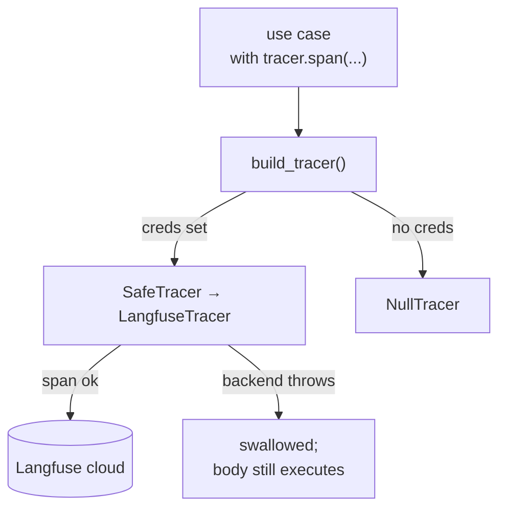

# SDD — Observability

| | |
|---|---|
| **Status** | Stable |
| **Context** | `shared` |
| **Concern** | Tracing every AI interaction without ever breaking a use case |
| **Source of truth** | [`shared/tracing.py`](../../backend/app/shared/tracing.py), [`shared/langfuse_tracer.py`](../../backend/app/shared/langfuse_tracer.py) |
| **Related** | [external-integrations](external-integrations.md) |

## TL;DR

Use cases wrap their LLM/vision calls in `tracer.span(name, input=...)` and
`span.set_output(...)`. A `TracingPort` abstracts the backend: `LangfuseTracer`
when credentials exist, `NullTracer` otherwise. Everything is wrapped in
`SafeTracer`, which guarantees the `with` body still runs even if the tracing
backend throws — **observability is best-effort and never a failure path**.

## Component flow

## Design notes

- **Selection at the edge.** `build_tracer()` returns `SafeTracer(LangfuseTracer())`
  only when both `LANGFUSE_PUBLIC_KEY` and `LANGFUSE_SECRET_KEY` are set;
  otherwise `NullTracer` ([`langfuse_tracer.py:40`](../../backend/app/shared/langfuse_tracer.py)).
- **Never break the use case.** `SafeTracer` enters/exits the inner span in
  `try/except`, yielding a `_SafeSpan` that swallows `set_output` errors
  ([`tracing.py:40`](../../backend/app/shared/tracing.py)).
- **What gets traced.** Manual generation captures the prompt + raw output;
  content generation captures `{brand_id, tipo, prompt}` — where `prompt`
  **includes the retrieved RAG rules** — and the generated text; image audit
  captures `{content_id}` and `{veredicto, motivo}`.
- **Inline flush.** `LangfuseTracer.span` calls `self._lf.flush()` on exit — no
  background worker ([`langfuse_tracer.py:37`](../../backend/app/shared/langfuse_tracer.py)).
- **Frontend surface.** If `NEXT_PUBLIC_LANGFUSE_URL` is set, the Superadmin sees
  an "Observabilidad" link to the dashboard
  ([`frontend/components/layout/app-layout.tsx:60`](../../frontend/components/layout/app-layout.tsx)).

## Reference index

| What | Where |
|---|---|
| `TracingPort` / `Span` protocols | [`tracing.py:5`](../../backend/app/shared/tracing.py) |
| `NullTracer` | [`tracing.py:21`](../../backend/app/shared/tracing.py) |
| `SafeTracer` | [`tracing.py:40`](../../backend/app/shared/tracing.py) |
| `LangfuseTracer` | [`langfuse_tracer.py:22`](../../backend/app/shared/langfuse_tracer.py) |
| `build_tracer()` selector | [`langfuse_tracer.py:40`](../../backend/app/shared/langfuse_tracer.py) |
| Span in manual generation | [`generate_brand_manual.py:79`](../../backend/app/contexts/brand_identity/application/generate_brand_manual.py) |
| Span in content generation | [`generate_content.py:75`](../../backend/app/contexts/content_creation/application/generate_content.py) |
| Span in image audit | [`audit_image.py:49`](../../backend/app/contexts/governance/application/audit_image.py) |
| Langfuse settings | [`config.py:34`](../../backend/app/config.py) |

## Maintenance checklist

- [ ] New AI use case? Wrap the model call in `tracer.span(...)` +
      `set_output(...)`; accept `tracer` via constructor (default `NullTracer`).
- [ ] Never let tracing raise into business logic — always go through
      `build_tracer()` / `SafeTracer`.
- [ ] Don't log secrets or full PII in span `input`/`output`.
- [ ] Traces missing? Check both Langfuse keys are present; without them the app
      silently uses `NullTracer` (by design).
