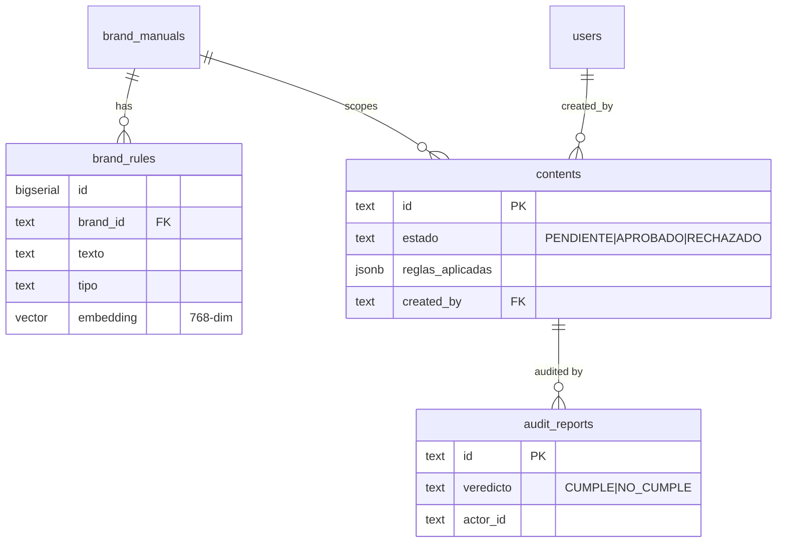

# SDD — Persistence

| | |
|---|---|
| **Status** | Stable |
| **Context** | `shared` + every context's `infrastructure/postgres_repo.py` |
| **Concern** | How data is stored, pooled, and migrated (Postgres/Supabase) |
| **Source of truth** | [`shared/db.py`](../../backend/app/shared/db.py) |
| **Related** | [rag-retrieval](rag-retrieval.md) (pgvector), [security-and-pii](security-and-pii.md) |

## TL;DR

A single module owns the DB: it holds the whole schema as idempotent DDL,
exposes a lazily-opened connection **pool**, and runs migrations via `ALTER
TABLE ... IF NOT EXISTS`. Because Supabase's transaction-mode pooler doesn't
support prepared statements, connections are configured with
`prepare_threshold=None`. Repositories in each context borrow a connection with
`with connect() as conn:` and speak plain SQL.

## Schema

Tables: `brand_manuals`, `brand_rules` (with `vector(768)` column),
`contents`, `users`, `audit_log`, `audit_reports`. `ON DELETE CASCADE` links
rules/contents/audits to their brand.

## Design notes

- **Idempotent init & migrations.** `init_db()` runs the full `_DDL` block with
  `create ... if not exists` and `alter table ... add column if not exists`, so
  `python -m app.shared.db` is safe to run repeatedly. New columns
  (`motivo`, `created_by`, brand `nombre`, audit `actor_id`) are added as
  migrations at the bottom of the DDL.
- **Lazy pool.** Opening a Supabase connection costs ~2s, so a
  `ConnectionPool` (min 2, max 10) is created on first use and reused. `connect()`
  borrows a connection and returns it to the pool on context exit (it is not
  closed).
- **pgvector registration.** The pool's `configure=register_vector` makes the
  `vector` type usable on every borrowed connection.
- **No prepared statements.** `kwargs={"prepare_threshold": None}` — mandatory
  for the transaction-mode pooler on port 6543.
- **Denormalized reads.** `PostgresContentRepo` LEFT JOINs `users` to attach
  `creator_email` without exposing the users endpoint
  ([`content_creation/infrastructure/postgres_repo.py:10`](../../backend/app/contexts/content_creation/infrastructure/postgres_repo.py)).

## Reference index

| What | Where |
|---|---|
| Full DDL (tables + migrations) | [`shared/db.py:12`](../../backend/app/shared/db.py) |
| Lazy connection pool | [`shared/db.py:94`](../../backend/app/shared/db.py) |
| `connect()` (borrow from pool) | [`shared/db.py:109`](../../backend/app/shared/db.py) |
| `init_db()` (idempotent) | [`shared/db.py:114`](../../backend/app/shared/db.py) |
| Brand repo | [`brand_identity/infrastructure/postgres_repo.py`](../../backend/app/contexts/brand_identity/infrastructure/postgres_repo.py) |
| Content repo (JOIN users for email) | [`content_creation/infrastructure/postgres_repo.py:17`](../../backend/app/contexts/content_creation/infrastructure/postgres_repo.py) |
| User + audit-log repos | [`identity_access/infrastructure/postgres_repos.py`](../../backend/app/contexts/identity_access/infrastructure/postgres_repos.py) |
| Audit-report repo | [`governance/infrastructure/postgres_repo.py`](../../backend/app/contexts/governance/infrastructure/postgres_repo.py) |
| `DATABASE_URL` (pooler) | [`config.py:17`](../../backend/app/config.py) |

## Maintenance checklist

- [ ] Schema change? Add it to `_DDL` as `create/alter ... if not exists` so
      `init_db()` stays idempotent — never a bare `create table`.
- [ ] New table read by a context? Add a repo in that context's
      `infrastructure/`, not shared code.
- [ ] Changed the embedding dimension? Update `vector(768)` in the DDL **and**
      `EMBEDDING_DIM` (see [rag-retrieval](rag-retrieval.md)).
- [ ] Still on the transaction pooler? Keep `prepare_threshold=None`.
