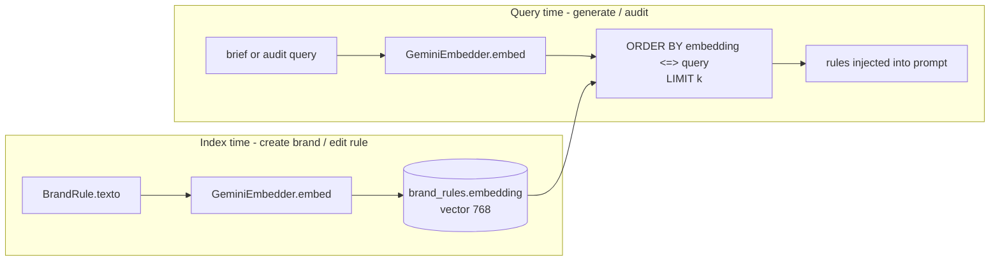

# SDD — RAG & Retrieval

| | |
|---|---|
| **Status** | Stable |
| **Context** | `brand_identity` (index/query) consumed by `content_creation` + `governance` |
| **Concern** | Semantic retrieval of brand rules to ground generation & audit |
| **Source of truth** | [`pgvector_store.py`](../../backend/app/contexts/brand_identity/infrastructure/pgvector_store.py) |
| **Related** | [persistence](persistence.md), [external-integrations](external-integrations.md), [content-lifecycle](content-lifecycle.md) |

## TL;DR

Brand rules are embedded with Gemini (`gemini-embedding-001`, 768-dim) and
stored in a pgvector column. Content generation and image audit **retrieve the
most relevant rules first** (cosine distance `<=>`), then inject them into the
LLM/vision prompt. Retrieval-before-generate is a hard requirement, not an
optimization: the model only ever sees rules that were actually pulled from the
manual.

## Flow

## Key behaviors

- **Index on write.** Creating a brand indexes all rules
  ([`generate_brand_manual.py:86`](../../backend/app/contexts/brand_identity/application/generate_brand_manual.py));
  adding/editing a rule re-embeds it. Editing **must** recompute the embedding,
  or the RAG would keep retrieving the rule by its stale meaning
  ([`pgvector_store.py:57`](../../backend/app/contexts/brand_identity/infrastructure/pgvector_store.py)).
- **Query k.** Default `k=5` nearest rules. Content generation and audit both
  set `self._k` (default 5).
- **Cosine similarity.** `order by embedding <=> query::vector limit k` — the
  `<=>` operator is pgvector's cosine distance.
- **Aggregate invariant.** A brand can't lose its last rule; `delete_rule`
  refuses when only one remains
  ([`pgvector_store.py:40`](../../backend/app/contexts/brand_identity/infrastructure/pgvector_store.py)).
- **Audit retrieval query.** Image audit uses a fixed semantic query for visual
  rules: *"reglas visuales de logo, color, tipografía e imagen de marca"*
  ([`audit_image.py:17`](../../backend/app/contexts/governance/application/audit_image.py)).

## Reference index

| What | Where |
|---|---|
| Embedder adapter (Gemini REST) | [`infrastructure/gemini_embedder.py:10`](../../backend/app/contexts/brand_identity/infrastructure/gemini_embedder.py) |
| `VectorStorePort` | [`brand_identity/domain/ports.py`](../../backend/app/contexts/brand_identity/domain/ports.py) |
| Index rules | [`pgvector_store.py:17`](../../backend/app/contexts/brand_identity/infrastructure/pgvector_store.py) |
| Similarity query | [`pgvector_store.py:72`](../../backend/app/contexts/brand_identity/infrastructure/pgvector_store.py) |
| Re-embed on rule update | [`pgvector_store.py:57`](../../backend/app/contexts/brand_identity/infrastructure/pgvector_store.py) |
| Last-rule invariant | [`pgvector_store.py:40`](../../backend/app/contexts/brand_identity/infrastructure/pgvector_store.py) |
| `RetrieveRelevantRules` use case | [`application/retrieve_relevant_rules.py:6`](../../backend/app/contexts/brand_identity/application/retrieve_relevant_rules.py) |
| Retrieve-before-generate (content) | [`generate_content.py:70`](../../backend/app/contexts/content_creation/application/generate_content.py) |
| Retrieve-before-audit (vision) | [`audit_image.py:47`](../../backend/app/contexts/governance/application/audit_image.py) |
| `EMBEDDING_MODEL` / `EMBEDDING_DIM` | [`config.py:25`](../../backend/app/config.py) |
| Vector column `vector(768)` | [`shared/db.py:30`](../../backend/app/shared/db.py) |

## Maintenance checklist

- [ ] Changed `EMBEDDING_DIM`? Update the `vector(...)` column in the DDL and
      **re-index existing rules** — old embeddings won't match new dimensions.
- [ ] Added a write path for rules? Ensure it embeds (or re-embeds) the text.
- [ ] Tuning recall? Adjust `k` at the use-case call site, not in the store.
- [ ] Large rule sets? Consider an `ivfflat`/`hnsw` index on
      `brand_rules.embedding` (currently a plain scan; fine for MVP volumes).
