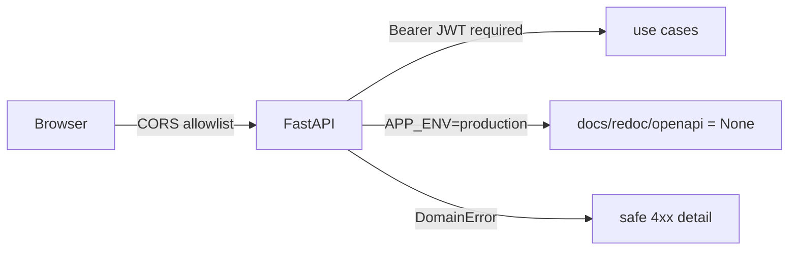

# SDD — Security & PII

| | |
|---|---|
| **Status** | Stable |
| **Concern** | Credentials, secrets, transport boundaries, prod hardening |
| **Source of truth** | [`main.py`](../../backend/app/main.py), [`config.py`](../../backend/app/config.py), [`pbkdf2_hasher.py`](../../backend/app/contexts/identity_access/infrastructure/pbkdf2_hasher.py) |
| **Related** | [authentication-authorization](authentication-authorization.md), [persistence](persistence.md) |

## TL;DR

Passwords are stored as salted PBKDF2-SHA256 hashes (never plaintext). Secrets
come from the environment and are required at startup (fail-fast). In production,
Swagger/ReDoc/OpenAPI are hidden so the API surface isn't published. CORS is an
explicit allowlist. Domain errors are translated to safe HTTP messages; login
failures are deliberately generic.

## Data sensitivity

| Data | Handling |
|---|---|
| Passwords | PBKDF2-HMAC-SHA256, 16-byte random salt, 200k iterations; verified with `hmac.compare_digest` (constant-time). Only the hash is stored. |
| JWT secret | From `JWT_SECRET`; default `dev-secret-change-me` **must** be overridden in prod. |
| Provider API keys | Env-only (`GROQ_API_KEY`, `GOOGLE_API_KEY`, `SUPABASE_SERVICE_ROLE_KEY`); never returned by the API. |
| User email | PII; returned only to authenticated users. Creator email is denormalized into content reads for display, not exposed via a public users endpoint. |
| Uploaded images | Read into memory, base64-encoded to the vision API, not persisted. |

## Boundary hardening

- **Fail-fast config.** `Settings` fields without defaults are required; the app
  crashes on startup if they're missing, and `lifespan` calls `get_settings()`
  to force it ([`config.py:15`](../../backend/app/config.py), [`main.py:15`](../../backend/app/main.py)).
- **Docs off in production.** When `APP_ENV=production`, `docs_url`/`redoc_url`/
  `openapi_url` are `None` ([`main.py:22`](../../backend/app/main.py)).
- **CORS allowlist.** `CORS_ORIGINS` (comma-separated) with a local dev default
  ([`main.py:33`](../../backend/app/main.py)).
- **Generic auth errors.** Login always returns `401 Credenciales inválidas`,
  never revealing whether the email exists
  ([`identity_access/interfaces/router.py:57`](../../backend/app/contexts/identity_access/interfaces/router.py)).
- **Active-user check.** `get_current_user` rejects inactive/deleted users even
  with a valid token ([`identity_access/interfaces/deps.py:55`](../../backend/app/contexts/identity_access/interfaces/deps.py)).
- **Sensitive actions audited.** User create/role-change/deactivate write to
  `audit_log` ([`manage_users.py:38`](../../backend/app/contexts/identity_access/application/manage_users.py)).

## Known MVP shortcuts (`ponytail:`)

- Password hashing is stdlib PBKDF2; migrate to argon2/bcrypt by swapping only
  `Pbkdf2Hasher` ([`pbkdf2_hasher.py:3`](../../backend/app/contexts/identity_access/infrastructure/pbkdf2_hasher.py)).
- Brand-name uniqueness is check-then-insert with a unique index as the real
  backstop ([`generate_brand_manual.py:67`](../../backend/app/contexts/brand_identity/application/generate_brand_manual.py)).
- Tokens live in `localStorage` (XSS-exposed); acceptable for the MVP, revisit
  with httpOnly cookies if hardening.

## Reference index

| What | Where |
|---|---|
| Password hasher | [`pbkdf2_hasher.py:14`](../../backend/app/contexts/identity_access/infrastructure/pbkdf2_hasher.py) |
| Required settings (fail-fast) | [`config.py:15`](../../backend/app/config.py) |
| Docs disabled in prod | [`main.py:22`](../../backend/app/main.py) |
| CORS middleware | [`main.py:33`](../../backend/app/main.py) |
| Generic login error | [`identity_access/interfaces/router.py:62`](../../backend/app/contexts/identity_access/interfaces/router.py) |
| Audit log writes | [`manage_users.py:42`](../../backend/app/contexts/identity_access/application/manage_users.py) |
| `DomainError` → HTTP mapping | [`shared/errors.py:1`](../../backend/app/shared/errors.py) |

## Maintenance checklist

- [ ] `JWT_SECRET`, all provider keys, and `DATABASE_URL` set from a real secret
      store in every non-local environment.
- [ ] `APP_ENV=production` set in prod so docs stay hidden.
- [ ] `CORS_ORIGINS` narrowed to real frontend origins in prod.
- [ ] New PII field? Confirm it's not leaked in error messages, logs, or trace
      `input`/`output`.
- [ ] New sensitive action? Add an `AuditLogEntry`.
